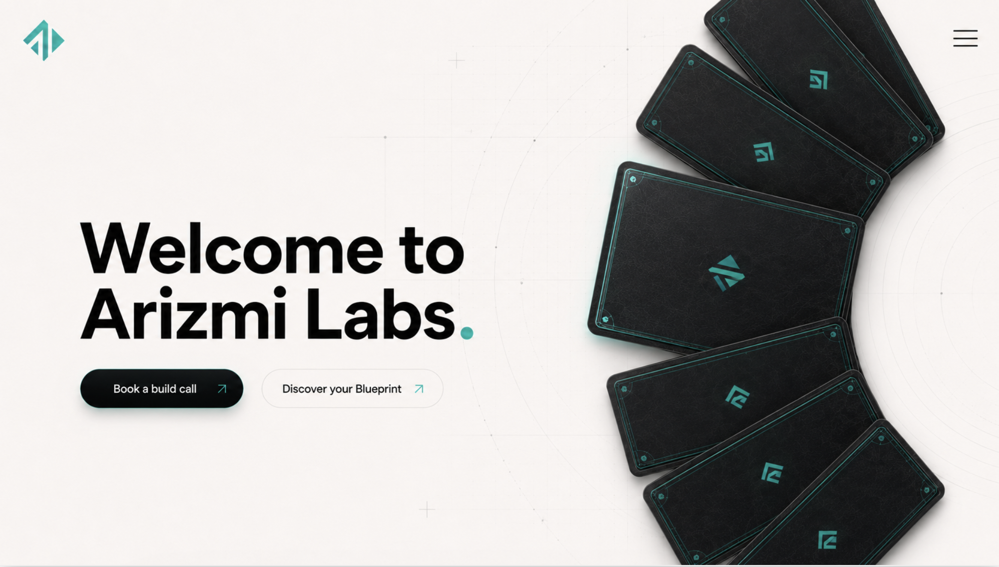
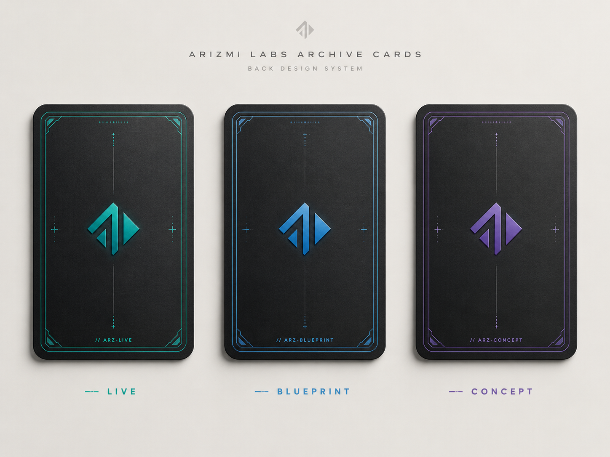

# Source of truth, assets, references, and decisions

## Captured source

- Primary brief: [Arizmi Labs website — Google Doc](https://docs.google.com/document/d/1X_7Q1O-kl6DjNw7rXmlaWj18yjpy45b78S-5mGQ9Trs/edit?usp=sharing)
- Google Doc ID: `1X_7Q1O-kl6DjNw7rXmlaWj18yjpy45b78S-5mGQ9Trs`
- Capture date: 2026-07-10
- Original asset folder retained for provenance: [Google Drive asset folder](https://drive.google.com/drive/folders/1HUSyg73IWvpOhloBEzV_e4pQJIH90PUK?usp=drive_link)
- Authoritative local asset set for implementation: [`public/New_Assets`](../../public/New_Assets/)

The source Doc contains tabs for Design details, Homepage and its sections, Navigation, Builds, BluePrint AI, Services, and About. The page specs in this directory preserve that content and the links embedded in those tabs.

## Brand foundation

| Role | Value |
| --- | --- |
| Arizmi teal light | `#03B6A3` |
| Arizmi teal mid | `#00AFA7` |
| Arizmi teal dark | `#019099` |
| Arizmi teal gradient | `#019099` → `#03B6A3` |
| Tech blue | `#2F8ED8` |
| Deep violet | `#6B4FD3` |
| Card black | `#101313` |
| Warm off-white | `#F7F5EF` |
| Main typeface | Manrope |
| Metadata typeface | Space Mono |

Exact contrast-safe text, muted-text, border, overlay, focus, success, warning, and error tokens still need to be derived in `TASK-001`; do not use opacity values that fail WCAG contrast.

## Local asset inventory and intended use

### Production assets

| Asset | Intended use |
| --- | --- |
| [`arizmi_card_back_live_teal.png`](../../public/New_Assets/arizmi_card_back_live_teal.png) | Live-build card back |
| [`arizmi_card_back_blueprint_tech_blue.png`](../../public/New_Assets/arizmi_card_back_blueprint_tech_blue.png) | BluePrint card back |
| [`arizmi_card_back_concept_deep_violet.png`](../../public/New_Assets/arizmi_card_back_concept_deep_violet.png) | Concept card back |
| [`ArizmiLabs_Logomark_Gradient SVG File -01.svg`](<../../public/New_Assets/Logo/2. Logomark/ArizmiLabs_Logomark_Gradient SVG File -01.svg>) | Preferred light-canvas hero/nav logomark |
| [`ArizmiLabs_Logomark_Black-01.svg`](<../../public/New_Assets/Logo/2. Logomark/ArizmiLabs_Logomark_Black-01.svg>) | Black single-colour mark |
| [`ArizmiLabs_Logomark_Solid SVG File-01.svg`](<../../public/New_Assets/Logo/2. Logomark/ArizmiLabs_Logomark_Solid SVG File-01.svg>) | Solid teal single-colour mark |
| [`ArizmiLabs_Primary_Gradient SVG File-01.svg`](<../../public/New_Assets/Logo/1. Primary_Logo/ArizmiLabs_Primary_Gradient SVG File-01.svg>) | Full primary logo where the wordmark is needed |
| [`Wordmark Gradient Color SVG -01.svg`](<../../public/New_Assets/Logo/3. Logo workmark/Wordmark Gradient Color SVG -01.svg>) | Standalone wordmark |
| [`Manrope-VariableFont_wght.ttf`](../../public/New_Assets/Fonts/Manrope/Manrope-VariableFont_wght.ttf) | Main variable font, preferred over multiple static files |
| [`SpaceMono-Regular.ttf`](../../public/New_Assets/Fonts/Space_Mono/SpaceMono-Regular.ttf) | Metadata regular |
| [`SpaceMono-Bold.ttf`](../../public/New_Assets/Fonts/Space_Mono/SpaceMono-Bold.ttf) | Metadata bold |

Other black, solid, white, PNG, AI, and PDF logo variants remain available in `public/New_Assets/Logo`. `TASK-001` should create stable, URL-safe runtime aliases without deleting the supplied originals.

### Preserved Google Doc reference images

These files were extracted from the Doc so implementation does not depend on temporary `googleusercontent.com` URLs.

#### Hero layout concept

Use for composition, scale, arc direction, and hierarchy. It is not a pixel-perfect final design and its generic card art is superseded by the production card-back PNGs.

#### Archive card system

Use for the relationship between the three card states and their color semantics.

#### About statistics layout reference

Use only for image-plus-stat layout direction. The visible numbers are not approved Arizmi facts and must not be shipped.

## External visual and interaction references

| Area | Reference | Borrow only |
| --- | --- | --- |
| Hero rotary archive | [Interactive Arc Deck](https://www.framer.com/community/marketplace/components/interactive-arc-deck/) | broad off-screen wheel, active-card emphasis, drag/scroll feel |
| Hero rotary archive | [Arc Gallery Pro](https://www.framer.com/community/marketplace/components/arc-gallery-pro/) | curved gallery spacing and controlled motion |
| Homepage process | [Scroll Steps](https://www.framer.com/community/marketplace/components/scroll-steps/) | sequential step activation while scrolling |
| Homepage build categories | [Bento Expand Grid](https://www.framer.com/community/marketplace/components/bentoexpandgrid/) | expandable bento behavior |
| Builds featured area | [Parallax Slider](https://www.framer.com/community/marketplace/components/parallax-slider/) | featured-project browsing motion |
| Builds cards | [Portfolio Card](https://www.framer.com/community/marketplace/components/portfoliocard/) | minimal closed state and expandable detail hierarchy |
| Services | [Accordion Service](https://www.framer.com/community/marketplace/components/accordion-service/) | service disclosure behavior |
| About stats | [Makora Studio About](https://makorastudio.com/about-us) | image-first stats composition |
| About team | [Team Carousel V1](https://www.framer.com/community/marketplace/components/team-carousel-v1/) | team browsing behavior |
| About team | [Tilt Profile Card](https://www.framer.com/community/marketplace/components/tilt-profile-card/) | restrained card depth/tilt and profile hierarchy |
| About ticker | [Hover Preview Ticker](https://www.framer.com/community/marketplace/components/hoverpreviewticker/) | ticker rhythm and hover preview pattern |

The brief also names Rive & Limn's navigation as inspiration but supplies no URL. Record a node-specific URL or screenshot before claiming visual parity.

## Open decisions and missing inputs

Update the Decision column when an owner resolves an item. Tasks may create intentional placeholders only where noted.

| ID | Missing input or conflict | Affected tasks | Safe default before decision | Decision |
| --- | --- | --- | --- | --- |
| D-01 | Production booking URL | 003, 005, 007, 014–017 | Use one environment-backed placeholder and never `#` in production | Pending |
| D-02 | Privacy Policy URL and approved consent language | 013, 014, 017 | Block production lead capture; local placeholder is allowed | Pending |
| D-03 | AI provider/model, budget, latency, and retention policy | 012–014 | Define an adapter interface; do not hard-code a vendor into UI | Pending |
| D-04 | Lead database/storage provider and retention/deletion policy | 013–014 | Define a repository interface and local/dev adapter only | Pending |
| D-05 | Full BluePrint PDF/email visual design and sender details | 014 | Use a branded HTML/document skeleton in development | Pending |
| D-06 | Public project URLs for all “Open/Explore” CTAs | 008–010 | Render disabled “Link coming soon” semantics, not fake URLs | Pending |
| D-07 | Featured build video/images | 009 | Approved neutral placeholders are explicitly allowed | Pending |
| D-08 | Builds labels conflict: defined taxonomy vs “Product Build” and “Launch Build” statuses | 008 | Preserve raw source fields separately; block UI taxonomy until normalized | Pending |
| D-09 | Hero project-card front content and which projects appear first | 005, 008 | Reuse normalized Builds data with a documented featured subset | Pending |
| D-10 | About statistics | 016 | Omit the stat values or show labeled content placeholders in dev only | Pending |
| D-11 | About team card images are referenced but absent from `New_Assets` | 016 | Initials/typographic placeholder, clearly marked for replacement | Pending |
| D-12 | About “Why Arizmi?” image | 016 | Use an abstract brand-system treatment, not stock imagery, pending approval | Pending |
| D-13 | Footer content is empty in the brief | 003, 017 | Minimal logo, primary links, contact, legal placeholders, copyright | Pending |
| D-14 | Careers route/content | 003, 017 | Hide or mark unavailable; do not create an empty indexed page | Pending |
| D-15 | Contact recipient and whether the current modal remains | 017 | Preserve existing form plumbing but centralize recipient/config | Pending |
| D-16 | Budget-range and timeline option sets in BluePrint lead gate | 013 | Add typed configuration with clearly marked draft options | Pending |
| D-17 | Whether full BluePrint is both emailed and downloadable | 014 | Fulfil the explicit email promise; make download conditional on approved storage/security design | Pending |
| D-18 | Verified Rive & Limn navigation reference URL or capture | 003 | Follow the written full-screen card-black menu requirements | Pending |

## Repository baseline relevant to implementation

- Next.js App Router with TypeScript; the installed package is Next `16.2.0` and React `19.2.3`.
- Only the `/` route currently exists.
- Existing animation infrastructure uses GSAP `3.14.2` and ScrollTrigger.
- Existing contact handling uses a server action, Nodemailer, a honeypot, and in-memory rate limiting.
- No database, AI SDK, PDF generator, schema validator, automated test runner, or component library is installed.
- Existing components are largely inline-styled and tied to the superseded dark visual system.
- `public/New_Assets` is currently untracked and includes `.DS_Store` files; preserve the actual assets and exclude operating-system metadata.

